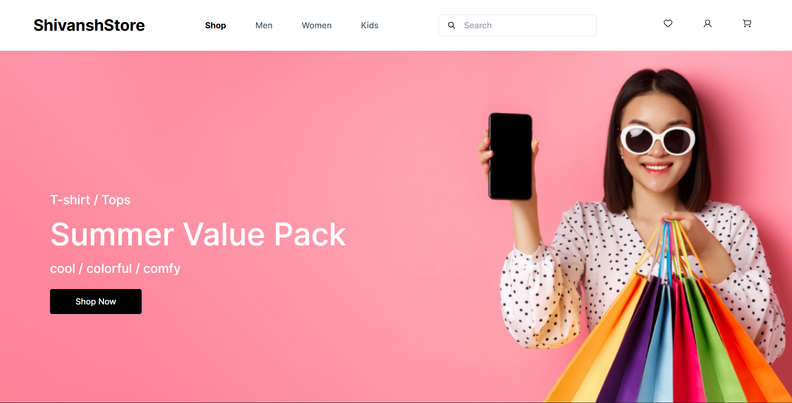

# 🛒 ShivanshStore Fullstack E-Commerce Project

Welcome to the Fullstack E-Commerce Shopping Project repository! This project is a work in progress and aims to build a comprehensive e-commerce application using React.js for the front-end and Spring Boot for the backend. Once completed, it will offer a complete online shopping experience with features like product browsing, cart management, and order processing.

## 🛠️ Technologies Being Used

- **Frontend**: React.js, Redux, Tailwind CSS, Axios
- **Backend**: Spring Boot, Spring Security, Spring Data JPA
- **Database**: PostgreSQL
- **Authentication**: JWT (JSON Web Tokens)
- **Payment Gateway**: (Optional integration with Stripe/PayPal)
- **Build Tools**: Maven, Webpack

## Current Status

| Feature | Status |
| --- | --- |
| Authentication | ✅ |
| Product listing | ✅ |
| Product images | ✅ |
| Cloudinary integration | ✅ |
| Wishlist |  ⚠️ In progress |
| Category filters |  ⚠️ In progress |
| Responsive design |  ⚠️ In progress |
| Stripe payments | ⚠️ In progress |

## ✅ To-Do List

### Frontend
✅ Set up React project structure 
✅ Implement a Home Page with different sections and a Footer 
✅ Create Mockup API Data (Content) 
✅ Pages Navigation & Categories Page with Filters 
✅ Product Detail Page 
✅ Shopping cart functionality 
✅ User authentication (sign-up, login, logout) 
✅ Checkout process

### Backend
✅ Set up Spring Boot project 
✅ Implement basic product API 
✅ User authentication and authorization with JWT 
✅ Order processing and management 
⬜ Integration with payment gateway 
⬜ Admin dashboard for product/order management

### Database
✅ Create PostgreSQL database schema 
✅ Set up entity relationships (products, users, orders) 
✅ Seed database with initial data

  
